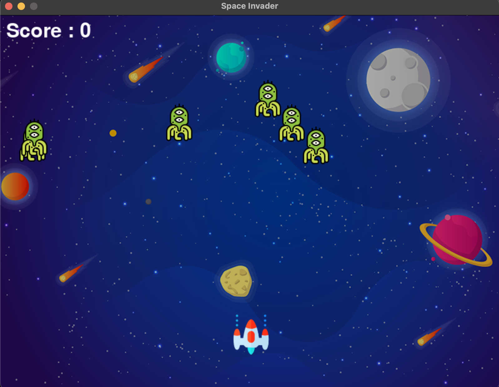

# Space Invaders

Implementation of Space Invaders games by using library of Python called Pygame

## Table of Contents

- [General Info](#general-information)
- [Technologies Used](#technologies-used)
- [Features](#features)
- [Screenshots](#screenshots)
- [Setup](#setup)
- [Room for Improvement](#room-for-improvement)

## General Information

Space Invaders is a game which you gain points by firing rocket to alien invaders. The goal of the project is implementing this game by using Pygame

## Technologies Used

- Python - 3.8.9
- Pygame - 2.1.2

## Features

Features of the game are:

- There is a background sound and image
- Player can move left and right
- Player can shoot rocket. If it hits one of the enemies, player hears sound and earn score
- Enemy aliens move left to right and right to left. In every turn, they move one unit down

## Screenshots

## Setup

To be able to start the project, we need to install necessary modules. To install modules specified in requirements.txt file, we can write `pip install -r requirements.txt` to the terminal.

After that to run the project, we need to use `python main.py`. This will open a new window which you can play the game.

## Usage

Game is played with keyboard and there are 3 buttons:

- Left key to move left
- Right key to move right
- Space to shoot rocket

## Room for Improvement

Include areas you believe need improvement / could be improved. Also add TODOs for future development.

Room for improvement:

- New chapters can be added
- New aliens can be added
